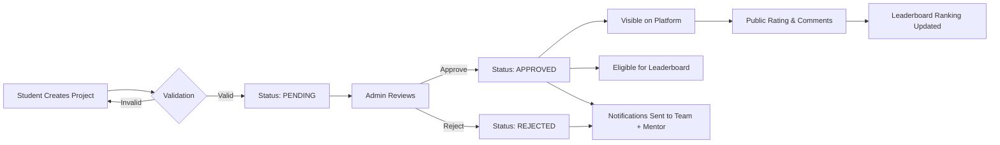

<div align="center">

# 💡 BrightBuilds

### *Empowering Student Innovation Through SDG-Aligned Project Showcasing*

A full-stack MERN platform connecting students, faculty, and innovators through creative coding projects mapped to the UN's 17 Sustainable Development Goals.

[](https://bright-builds.vercel.app/)
[](https://github.com/Shane-Dias/BrightBuilds)

---

### 🎯 Platform Stats


</div>

---

## 📖 Table of Contents

<details>
<summary>Click to expand</summary>

- [Why BrightBuilds?](#-why-brightbuilds)
- [Key Features](#-key-features)
- [Tech Stack](#-tech-stack)
- [Quick Start](#-quick-start)
- [Architecture](#-architecture)
- [Feature Deep Dive](#-feature-deep-dive)
  - [User Roles & Permissions](#user-roles--permissions)
  - [Project Workflow](#project-workflow)
  - [Leaderboard System](#leaderboard-system)
  - [AI Assistant](#ai-assistant)
  - [SDG Tracking](#sdg-tracking)
- [API Documentation](#-api-documentation)
- [Demo & Screenshots](#-demo--screenshots)
- [Environment Setup](#-environment-setup)
- [Contributing](#-contributing)
- [FAQ](#-faq)
- [Acknowledgements](#-acknowledgements)

</details>

---

## 🌟 Why BrightBuilds?

> **The Problem:** Students create amazing projects but struggle to showcase them effectively, align work with sustainability goals, and gain recognition from peers and industry.

> **The Solution:** BrightBuilds provides a centralized, gamified platform where students can:
> - 📤 Submit projects with rich media and SDG alignment
> - 🏆 Compete on leaderboards based on peer ratings and engagement
> - 🤖 Get AI-powered guidance on project ideation and SDG mapping
> - 👥 Connect with faculty mentors and industry professionals
> - 📊 Track sustainability impact across 17 UN goals

---

## ✨ Key Features

<table>
<tr>
<td width="50%">

### 🔐 **Secure & Role-Based**
- JWT authentication with 7-day sessions
- 4 distinct user roles (Student, Faculty, Admin, Public)
- Bcrypt password hashing (10 salt rounds)
- Protected routes with middleware

</td>
<td width="50%">

### 🚀 **Project Management**
- Multi-media uploads (up to 3 images, 5MB each)
- 5 project categories (Games, Websites, Videos, Art, Documentaries)
- Admin moderation workflow (Pending → Approved/Rejected)
- Automatic notifications on status changes

</td>
</tr>
<tr>
<td width="50%">

### 🏆 **Gamification Engine**
- **Weekly Leaderboard:** Top 5 projects from last 7 days
- **Overall Leaderboard:** Top 10 all-time projects
- Ranked by averaged ratings + likes
- Visible ranking badges on project cards

</td>
<td width="50%">

### 🤖 **AI-Powered Assistant**
- Google Gemini 1.5 Flash integration
- Voice input via Web Speech API
- 6 pre-configured suggestion prompts
- Project ideation, SDG mapping, and course recommendations

</td>
</tr>
<tr>
<td width="50%">

### 🌍 **SDG Impact Tracking**
- Map projects to any of 17 UN goals
- Aggregated dashboard with drill-down views
- Impact summary and contribution metrics
- Interactive SDG cards with project counts

</td>
<td width="50%">

### 💬 **Engagement Features**
- Threaded comment system with nested replies
- One-per-user rating (averaged scoring)
- One-per-user like system
- 7 notification types with real-time alerts

</td>
</tr>
</table>

---

## 🛠️ Tech Stack

<div align="center">

### Frontend


### Backend


### Services & Tools


</div>

<details>
<summary><b>📦 Full Dependency List</b></summary>

**Frontend:**
- **Core:** React 19, React Router v7, Axios
- **Styling:** Tailwind CSS 3, PostCSS, Autoprefixer
- **Animation:** Framer Motion 12, Spline, tsparticles
- **Charts:** Recharts
- **UI/UX:** React Toastify, SweetAlert2, Lucide React, React Icons
- **Utils:** html2canvas, react-simple-typewriter, class-variance-authority

**Backend:**
- **Core:** Express.js, Mongoose
- **Auth:** jsonwebtoken, bcryptjs
- **File Upload:** Multer, multer-storage-cloudinary, Cloudinary
- **AI:** @google/generative-ai
- **Utils:** cors, dotenv, nodemon (dev)

</details>

---

## ⚡ Quick Start

> **TL;DR:** Get BrightBuilds running locally in 3 minutes.

### Prerequisites Checklist

- [ ] Node.js v16+ installed
- [ ] MongoDB account ([Atlas Free Tier](https://www.mongodb.com/atlas))
- [ ] Cloudinary account ([Free Tier](https://cloudinary.com/))
- [ ] Gemini API key ([Get one free](https://aistudio.google.com/apikey))

### Installation

```bash
# 1. Clone the repository
git clone https://github.com/Shane-Dias/BrightBuilds.git
cd BrightBuilds

# 2. Install backend dependencies
cd backend
npm install

# 3. Create backend/.env (see Environment Setup section for values)
# Copy the template below and fill in your credentials

# 4. Start backend server
node server.js
# ✅ Backend running at http://localhost:5000

# 5. Install frontend dependencies (new terminal)
cd ../frontend
npm install

# 6. Create frontend/.env
echo "VITE_BACKEND_URL=http://localhost:5000" > .env

# 7. Start frontend dev server
npm run dev
# ✅ Frontend running at http://localhost:5173
```

> 🎉 **Done!** Open http://localhost:5173 in your browser.

---

## 🏗 Architecture

### System Overview

```ascii
┌─────────────────────────────────────────────────────────────────┐
│                         CLIENT LAYER                             │
│  ┌──────────────┐  ┌──────────────┐  ┌──────────────┐          │
│  │   React UI   │  │  React Router│  │  TailwindCSS │          │
│  │  Components  │  │   (v7 SPA)   │  │   + Framer   │          │
│  └──────┬───────┘  └──────┬───────┘  └──────────────┘          │
│         │                  │                                      │
│         └──────────────────┴────────── Axios HTTP Client         │
└─────────────────────────────┬───────────────────────────────────┘
                              │
                         JWT Bearer Token
                              │
┌─────────────────────────────▼───────────────────────────────────┐
│                         SERVER LAYER                             │
│  ┌──────────────────────────────────────────────────────┐       │
│  │          Express.js REST API (28 Endpoints)          │       │
│  │  ┌──────────┐ ┌──────────┐ ┌──────────┐ ┌─────────┐│       │
│  │  │  Auth    │ │ Project  │ │ Comment  │ │  AI     ││       │
│  │  │ Middleware│ │Controller│ │Controller│ │Assistant││       │
│  │  └──────────┘ └──────────┘ └──────────┘ └─────────┘│       │
│  └──────────────────────────────────────────────────────┘       │
└─────────┬───────────────┬──────────────┬────────────────────────┘
          │               │              │
          │               │              │
    ┌─────▼─────┐  ┌─────▼─────┐  ┌────▼─────┐
    │  MongoDB   │  │ Cloudinary │  │  Gemini  │
    │   Atlas    │  │    CDN     │  │ AI API   │
    │            │  │            │  │          │
    │ 4 Schemas: │  │ Image      │  │ 1.5 Flash │
    │ • User     │  │ Uploads    │  │ Model    │
    │ • Project  │  │ 3 files    │  │          │
    │ • Comment  │  │ 5MB each   │  │          │
    │ • Notif.   │  │            │  │          │
    └───────────┘  └───────────┘  └──────────┘
```

### Data Models

<details>
<summary><b>📊 Mongoose Schema Details</b></summary>

| Model | Fields | Relationships |
|---|---|---|
| **User** | fullName, email, password, age, gender, mobile, role, institution, profileImage, social links | → likedBy, ratedBy in Project |
| **Project** | title, description, media[], sdgs[], techStack[], teammates[], mentor, category, status, likes, rating, ratedBy[] | ← Comments, ← Notifications |
| **Comment** | projectId, userId, commentText, isPrivate, replies[{replyText, userId, createdAt}] | → Project, → User |
| **Notification** | sentBy, sentTo, title, message, type (7 variants), isRead | → User (sender/receiver) |

**Key Relationships:**
- Projects store `likedBy[]` and `ratedBy[]` arrays (ObjectId refs to User)
- Comments reference Project and User, with nested reply subdocuments
- Notifications link two Users (sender → receiver) with 7 event types

</details>

---

## 🎯 Feature Deep Dive

### User Roles & Permissions

<table>
<thead>
<tr>
<th width="20%">Role</th>
<th width="40%">Capabilities</th>
<th width="40%">Dashboard Access</th>
</tr>
</thead>
<tbody>
<tr>
<td><b>🧑‍💻 Student</b></td>
<td>
• Create project submissions<br>
• View personal projects<br>
• Track leaderboard rankings<br>
• Filter by approval status
</td>
<td>
→ Personal project list<br>
→ Leaderboard ranking badges<br>
→ Status indicators (Pending/Approved/Rejected)
</td>
</tr>
<tr>
<td><b>👨‍🏫 Faculty</b></td>
<td>
• View mentored projects<br>
• Monitor project performance<br>
• Rate and comment on submissions<br>
• Track mentee progress
</td>
<td>
→ Mentored projects view<br>
→ Performance metrics<br>
→ Approval status filters
</td>
</tr>
<tr>
<td><b>🛡️ Admin</b></td>
<td>
• Approve/reject projects<br>
• Manage all users<br>
• View analytics & reports<br>
• Track SDG distribution<br>
• Delete accounts
</td>
<td>
<b>4-Tab Dashboard:</b><br>
1. Project Moderation<br>
2. User Management<br>
3. Reports & Analytics<br>
4. SDG Tracking
</td>
</tr>
<tr>
<td><b>🔍 Public</b></td>
<td>
• Browse approved projects<br>
• Rate and like projects<br>
• Leave comments<br>
• View leaderboards<br>
• Explore SDG impact
</td>
<td>
→ Public project gallery<br>
→ Category filters<br>
→ Leaderboard view
</td>
</tr>
</tbody>
</table>

### Project Workflow



**Flow Details:**
1. **Submission:** Student fills form with title, description, GitHub/hosted links, SDG tags, tech stack, teammates, mentor, and uploads up to 3 images
2. **Validation:** Backend checks required fields, file size limits (5MB each), and format (jpg/png/jpeg/webp)
3. **Pending State:** Project saved with `status: "pending"`, not visible on public gallery
4. **Admin Review:** Admin sees project in Moderation tab with full details and Approve/Reject buttons
5. **Status Change:** Admin clicks action → Backend updates status → Notifications auto-sent to all teammates AND mentor
6. **Approved Projects:** Appear in public gallery, eligible for ratings/likes, included in leaderboard calculations
7. **Rejected Projects:** Remain hidden, show status to team members in their dashboard

### Leaderboard System

**🏆 Weekly Leaderboard (Top 5)**
- Projects from last 7 days
- Sorted by: `avgRating DESC, likes DESC`
- Only `status: "approved"` projects
- Refreshes dynamically on each page load

**🥇 Overall Leaderboard (Top 10)**
- All-time top projects
- Same sorting criteria
- Showcases platform's best work

**Ranking Badge Display:**
- 🥇 Rank 1-3: Gold badge
- 🥈 Rank 4-5: Silver badge (Weekly)
- 🥉 Rank 6-10: Bronze badge (Overall)
- Badges appear on project cards across all dashboards

### AI Assistant

<table>
<tr>
<td width="60%">

**Powered by Google Gemini 1.5 Flash**

The AI chatbot provides intelligent project guidance:

- **6 Suggestion Prompts:**
  1. Project creation tips
  2. SDG mapping guidance
  3. Course recommendations
  4. Innovation trends
  5. Project ideas by category
  6. Tech stack suggestions

- **Voice Input:** Web Speech API integration for hands-free queries
- **Formatted Responses:** Headings, bullet lists, and paragraphs parsed from AI output
- **Graceful Fallback:** Pre-configured responses when API is unavailable

</td>
<td width="40%">

**Sample Queries:**

> "How do I map my recycling app to SDG goals?"

> "Suggest tech stack for a climate awareness game"

> "Best practices for documentary project submissions"

**Response Format:**
```
📌 Key Points:
• Point 1 with details
• Point 2 with examples

💡 Recommendations:
...formatted output...
```

</td>
</tr>
</table>

### SDG Tracking

**17 UN Sustainable Development Goals Supported:**

| Goal # | Name | Icon |
|---|---|---|
| 1 | No Poverty | 🚫💰 |
| 2 | Zero Hunger | 🌾 |
| 3 | Good Health and Well-being | ⚕️ |
| 4 | Quality Education | 📚 |
| 5 | Gender Equality | ⚖️ |
| 6 | Clean Water and Sanitation | 💧 |
| 7 | Affordable and Clean Energy | ⚡ |
| 8 | Decent Work and Economic Growth | 💼 |
| 9 | Industry, Innovation and Infrastructure | 🏗️ |
| 10 | Reduced Inequality | ➡️⬅️ |
| 11 | Sustainable Cities and Communities | 🏙️ |
| 12 | Responsible Consumption and Production | ♻️ |
| 13 | Climate Action | 🌍 |
| 14 | Life Below Water | 🐠 |
| 15 | Life on Land | 🌳 |
| 16 | Peace, Justice and Strong Institutions | ⚖️ |
| 17 | Partnerships for the Goals | 🤝 |

**Features:**
- Projects can be tagged with multiple SDGs
- SDG aggregation dashboard shows project count per goal
- Click any SDG card to drill down and see associated projects
- Impact summary displays total SDGs addressed and contribution metrics

---

## 📡 API Documentation

### Overview

| Category | Endpoints | Auth Required | Admin Only |
|---|---|---|---|
| **User Management** | 8 | 3 endpoints | 2 endpoints |
| **Projects** | 12 | 4 endpoints | 1 endpoint |
| **Comments** | 3 | 2 endpoints | 0 endpoints |
| **Notifications** | 4 | 0 endpoints | 0 endpoints |
| **AI Assistant** | 1 | 0 endpoints | 0 endpoints |
| **Total** | **28** | **9** | **3** |

<details>
<summary><b>🔗 User Routes — <code>/api/users</code></b></summary>

| Method | Endpoint | Auth | Description |
|---|---|---|---|
| POST | `/signup` | — | Register new user with role selection |
| POST | `/login` | — | Authenticate & receive JWT (7-day expiry) |
| GET | `/details/:id` | — | Get user by ID (public profile) |
| GET | `/userDetails/:username` | — | Get user by username |
| GET | `/details` | ✅ | Get authenticated user's own details |
| PUT | `/update/:id` | — | Update user profile (name, institution, socials) |
| GET | `/admin/all-users` | ✅ Admin | List all users with role filter |
| DELETE | `/admin/delete-user/:userId` | ✅ Admin | Delete user account (with confirmation) |

**Sample Request:**
```bash
# Login
curl -X POST http://localhost:5000/api/users/login \
  -H "Content-Type: application/json" \
  -d '{"email": "student@example.com", "password": "securepass"}'

# Response
{
  "token": "eyJhbGciOiJIUzI1NiIsInR5cCI6IkpXVCJ9...",
  "user": {
    "id": "507f1f77bcf86cd799439011",
    "fullName": "John Doe",
    "email": "student@example.com",
    "role": "Student"
  }
}
```

</details>

<details>
<summary><b>📁 Project Routes — <code>/api</code></b></summary>

| Method | Endpoint | Auth | Description |
|---|---|---|---|
| POST | `/create` | — | Create project (multipart/form-data, up to 3 files) |
| GET | `/projects` | — | Get all approved projects |
| GET | `/details/:id` | — | Get project by ID with full details |
| GET | `/pendingprojects` | — | Get all pending projects (for admin) |
| PUT | `/update-status/:id` | — | Approve/reject project + send notifications |
| GET | `/projects/user/:username` | — | Get projects by teammate username |
| GET | `/projects/mentor/:username` | — | Get projects by mentor username |
| POST | `/:projectId/like` | ✅ | Toggle like on a project (one per user) |
| POST | `/:projectId/rate` | ✅ | Rate project 1-5 stars (one per user, averaged) |
| GET | `/sdg-summary` | — | Get projects grouped by SDG |
| GET | `/analytics/debug` | ✅ | Debug analytics data (dev endpoint) |
| GET | `/analytics/summary` | ✅ Admin | Admin analytics (total projects, monthly trends, user stats) |

**Sample Request:**
```bash
# Create Project (form-data)
curl -X POST http://localhost:5000/api/create \
  -F "title=Climate Tracker App" \
  -F "description=Real-time CO2 monitoring dashboard" \
  -F "github=https://github.com/user/climate-tracker" \
  -F "sdgs[]=Climate Action" \
  -F "sdgs[]=Sustainable Cities" \
  -F "teammates[]=John Doe" \
  -F "media=@screenshot1.png" \
  -F "media=@screenshot2.png"
```

</details>

<details>
<summary><b>💬 Comment Routes — <code>/api/comments</code></b></summary>

| Method | Endpoint | Auth | Description |
|---|---|---|---|
| POST | `/:projectId` | ✅ | Add top-level comment to project |
| GET | `/:projectId` | — | Get all comments for a project (with replies) |
| POST | `/:commentId/replies` | ✅ | Add nested reply to a comment |

**Admin comments are automatically marked `isPrivate: true` (visible only to project team).**

</details>

<details>
<summary><b>🔔 Notification Routes — <code>/api/notifications</code></b></summary>

| Method | Endpoint | Auth | Description |
|---|---|---|---|
| POST | `/` | — | Create notification (auto-triggered by system) |
| GET | `/:userId` | — | Get all notifications for a user |
| PUT | `/read/:id` | — | Mark notification as read |
| DELETE | `/:id` | — | Delete notification |

**7 Notification Types:**
`projectComment`, `like`, `rating`, `projectSubmission`, `projectStatus`, `achievement`, `general`

</details>

<details>
<summary><b>🤖 AI Assistant — <code>/api</code></b></summary>

| Method | Endpoint | Auth | Description |
|---|---|---|---|
| POST | `/studyAssistant` | — | Query Gemini AI with project-related questions |

**Sample Request:**
```bash
curl -X POST http://localhost:5000/api/studyAssistant \
  -H "Content-Type: application/json" \
  -d '{"query": "How do I choose the right SDGs for my recycling game?"}'
```

</details>

---

## 🎥 Demo & Screenshots

### 📹 [**Watch Full Walkthrough Video (Google Drive)**](https://drive.google.com/file/d/147g674Ghl8Db4roQ2XncPpJjk9YWZMHm/view?usp=sharing)

### 📊 [**View Presentation Slides**](https://docs.google.com/presentation/d/1CKfKLp3JPO2Sw8rWsrGTMdtCjujfiAur/edit?usp=sharing&ouid=104156333389831005794&rtpof=true&sd=true)

---

### 📸 Platform Screenshots

<table>
<tr>
<td align="center"><b>🏠 Home Page</b></td>
<td align="center"><b>🧑‍💻 Student Dashboard</b></td>
</tr>
<tr>
<td></td>
<td></td>
</tr>
<tr>
<td align="center"><b>➕ Create Project Form</b></td>
<td align="center"><b>📄 Project Details</b></td>
</tr>
<tr>
<td></td>
<td></td>
</tr>
<tr>
<td align="center"><b>🗂️ Explore Projects</b></td>
<td align="center"><b>👤 User Profile</b></td>
</tr>
<tr>
<td></td>
<td></td>
</tr>
<tr>
<td align="center"><b>🛡️ Admin — Moderation</b></td>
<td align="center"><b>📊 Admin — Analytics</b></td>
</tr>
<tr>
<td></td>
<td></td>
</tr>
</table>

---

## 🔑 Environment Setup

### Backend Configuration

Create `backend/.env` with the following variables:

```env
# Server
PORT=5000

# Database
MONGO_URI=mongodb+srv://<username>:<password>@cluster.mongodb.net/brightbuilds?retryWrites=true&w=majority

# Authentication
JWT_SECRET=your_super_secret_32_character_string_here_change_in_production

# Cloudinary (Image Storage)
CLOUDINARY_CLOUD_NAME=your_cloud_name
CLOUDINARY_API_KEY=your_api_key
CLOUDINARY_API_SECRET=your_api_secret

# AI Assistant
GEMINI_API_KEY=your_gemini_api_key_from_google_ai_studio
```

### Frontend Configuration

Create `frontend/.env`:

```env
VITE_BACKEND_URL=http://localhost:5000
```

### 🔗 Where to Get Credentials

| Service | Steps to Obtain |
|---|---|
| **MongoDB Atlas** | 1. Sign up at [mongodb.com/atlas](https://www.mongodb.com/atlas)<br>2. Create a free cluster<br>3. Go to Database → Connect → Drivers<br>4. Copy connection string and replace `<password>` |
| **Cloudinary** | 1. Sign up at [cloudinary.com](https://cloudinary.com/)<br>2. Go to Dashboard<br>3. Copy Cloud Name, API Key, and API Secret |
| **Gemini API** | 1. Visit [aistudio.google.com/apikey](https://aistudio.google.com/apikey)<br>2. Sign in with Google<br>3. Click "Create API Key"<br>4. Copy the generated key |
| **JWT Secret** | Generate a random 32+ character string:<br>`node -e "console.log(require('crypto').randomBytes(32).toString('hex'))"` |

---

## 🤝 Contributing

We welcome contributions from the community! Here's how you can help:

### 🐛 Report Bugs

Found a bug? [Open an issue](https://github.com/Shane-Dias/BrightBuilds/issues) with:
- Clear description of the problem
- Steps to reproduce
- Expected vs actual behavior
- Screenshots if applicable

### 💡 Suggest Features

Have an idea? We'd love to hear it! Open an issue with the `enhancement` label.

### 🔧 Submit Pull Requests

1. **Fork** the repository
2. **Clone** your fork: `git clone https://github.com/YOUR_USERNAME/BrightBuilds.git`
3. **Create a branch**: `git checkout -b feature/amazing-feature`
4. **Make changes** and commit: `git commit -m "Add amazing feature"`
5. **Push** to your fork: `git push origin feature/amazing-feature`
6. **Open a Pull Request** with a clear description

### 🎯 Areas We Need Help With

- [ ] **Accessibility:** ARIA labels, keyboard navigation, screen reader support
- [ ] **Testing:** Unit tests, integration tests, E2E tests
- [ ] **Documentation:** API docs, code comments, tutorials
- [ ] **UI/UX:** Mobile responsiveness, dark mode toggling, animations
- [ ] **Features:** Search functionality, project editing, email notifications
- [ ] **Performance:** Code splitting, lazy loading, image optimization

### 📜 Code Style Guidelines

- Use Prettier for formatting
- Follow [Airbnb JavaScript Style Guide](https://github.com/airbnb/javascript)
- Write meaningful commit messages
- Add comments for complex logic

---

## ❓ FAQ

<details>
<summary><b>Q: Can I run this without Cloudinary?</b></summary>

A: Currently, Cloudinary is required for image uploads. You could modify the `upload.js` middleware to use local storage or another service, but you'll need to update the file handling logic.

</details>

<details>
<summary><b>Q: Is the Gemini AI mandatory?</b></summary>

A: No. The chatbot has fallback responses if the API key is missing or the API is down. You can use the platform without AI features.

</details>

<details>
<summary><b>Q: How do I create the first admin user?</b></summary>

A: During signup, select "Admin" as the role. In production, you should modify the signup controller to restrict admin role creation or manually update a user's role in MongoDB.

</details>

<details>
<summary><b>Q: Can I deploy this for free?</b></summary>

A: Yes! Use:
- **Frontend:** Vercel (free tier)
- **Backend:** Railway, Render, or Fly.io (free tiers with limitations)
- **Database:** MongoDB Atlas (free 512MB cluster)
- **Images:** Cloudinary (free 25GB storage)
- **AI:** Gemini API (free tier with rate limits)

</details>

<details>
<summary><b>Q: How do I reset the database?</b></summary>

A: In MongoDB Atlas:
1. Go to Collections
2. Select the `brightbuilds` database
3. Click the trash icon to drop collections or the entire database
4. Restart your backend server to recreate indexes

</details>

<details>
<summary><b>Q: Why aren't my projects showing on the public page?</b></summary>

A: Only projects with `status: "approved"` are visible publicly. Check:
1. Is your project status "Pending"? → Needs admin approval
2. Are you logged in as admin? → Go to Admin Dashboard → Moderation tab → Approve projects
3. Is the backend connected? → Check console for API errors

</details>

<details>
<summary><b>Q: Can students edit projects after submission?</b></summary>

A: Currently, no. This is a planned feature. Students can:
- View their projects in the dashboard
- See status (Pending/Approved/Rejected)
- Track ratings and comments

To implement editing, you'd need to add:
- Edit button on student dashboard
- PUT endpoint for project updates
- Re-submission approval workflow

</details>

---

## 🙏 Acknowledgements

<div align="center">

### Built by **Shane Dias** & **Serene Dmello**

> *Two students who believed that learning doesn't stop in the classroom.*

This project was born from **curiosity**, fueled by **collaboration**, and built entirely through **self-initiative** — without external mentorship or institutional guidance.

**BrightBuilds** stands as proof that when you combine:
- 🧠 Purposeful learning
- 💻 Hands-on experimentation
- 🌍 Sustainability-focused vision  
- ⏰ Countless hours of debugging

...you can build something meaningful.

---

### 🌟 Special Thanks

- The **open-source community** for incredible tools and libraries
- **Stack Overflow** for saving us at 3 AM
- **Google Gemini** for powering our AI assistant
- **MongoDB, Vercel, and Cloudinary** for generous free tiers
- Everyone who believes students should **build boldly** and **think independently**

---

### 💬 Get in Touch

Have questions? Want to collaborate? Reach out:

[](https://github.com/Shane-Dias)
[](mailto:shanedias@example.com)

---

### 📄 License

This project is **open source** and available under the MIT License.

---

<p align="center">
  <b>Made with ❤️ for a sustainable future</b><br>
  <sub>Empowering students to showcase innovation, one project at a time.</sub>
</p>

<p align="center">
  <a href="#-brightbuilds">⬆️ Back to Top</a>
</p>

</div>
